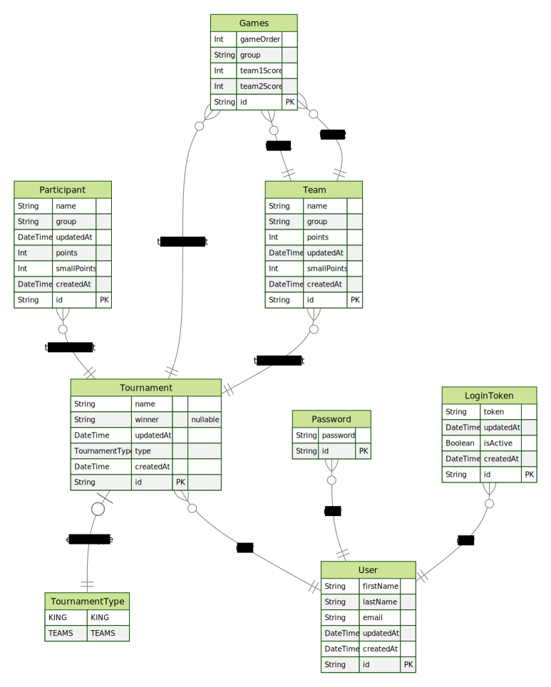

# wupzy

### Requirements

  - [Node.js](https://nodejs.org/en/)
  - [Yarn](https://yarnpkg.com/)

### Install dependencies

    yarn install

### Create table

    yarn prisma db push

### To see the database

    yarn prisma studio

### Generate Prisma Client

    yarn prisma generate

### Run the app

    yarn start

### Run the app in development mode
  
    yarn dev

## ERD Diagram

###
  To run generator, run this command in your terminal:

    npx prisma generate

